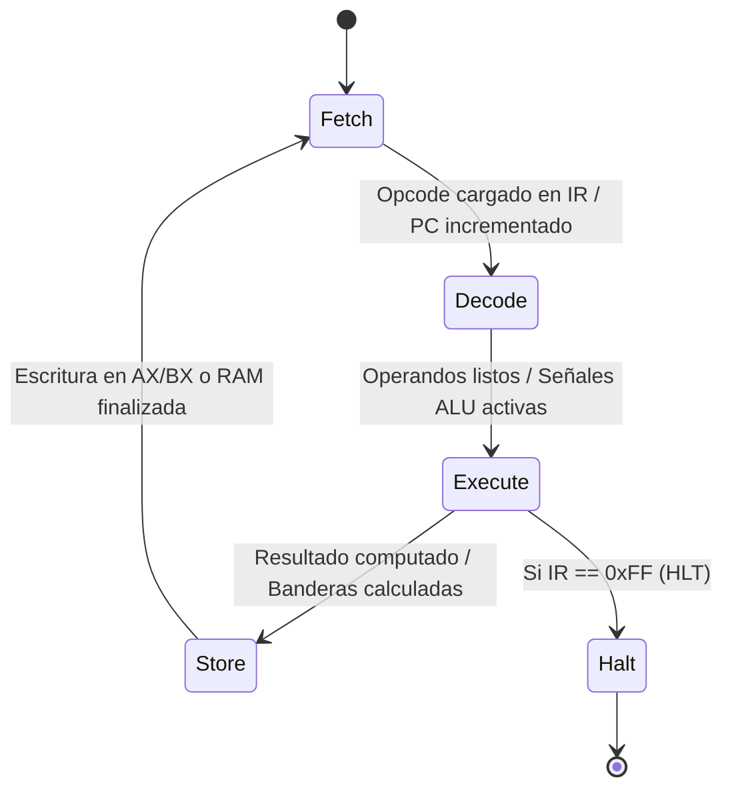

# Simulador de CPU (Arquitectura von Neumann / x86 de 8 bits) y Memoria Principal

**Universidad Católica Boliviana "San Pablo"**  
**Departamento de Ingenierías y Ciencias Exactas — Semestre 1/2026**  
**Materia:** Arquitectura de Computadoras (SIS-131)  
**Docente:** Ing. Paulo César Loayza Carrasco  
**Estudiante:** Kevin (Kevin07k)  

---

## 1. Descripción del Proyecto

Este proyecto implementa un **Simulador de Computadora von Neumann de 8 bits** completamente funcional, modular y visual, diseñado para ejecutarse sobre **Google Sheets** utilizando lógica de bajo nivel programada en **JavaScript (Google Apps Script - GAS)** y versionada en local mediante la herramienta oficial **Google Clasp (`@google/clasp`)**.

El procesador modela con rigurosidad matemática y de hardware las cuatro fases del ciclo de reloj (**Fetch, Decode, Execute, Store**), incorporando buses internos, registros dedicados, una Unidad Aritmético-Lógica (ALU) con cálculo de banderas (`ZF`, `CF`, `SF`), y una memoria RAM de 256 bytes (`0x00` - `0xFF`) segmentada lógicamente.

---

## 2. Diagrama de Arquitectura de Hardware (Mermaid)

El siguiente diagrama detalla la interconexión entre la Memoria Principal, el Banco de Registros, los Buses del Sistema y la Unidad de Control:

```mermaid
graph TD
    subgraph Memoria_Principal ["Memoria Principal RAM (256 Bytes: 00h - FFh)"]
        RAM["RAM Matrix 16x16<br/>Segmento Código: 00h - 7Fh<br/>Segmento Datos: 80h - FFh"]
    end

    subgraph CPU ["Unidad Central de Procesamiento (CPU de 8 bits)"]
        subgraph Bus_Interface ["Interfaz de Bus y Registros de Enlace"]
            MAR["MAR (Memory Address Register)<br/>8 bits"]
            MDR["MDR / MBR (Memory Data Register)<br/>8 bits"]
        end

        subgraph Registros ["Banco de Registros Internos"]
            PC["PC (Program Counter)<br/>8 bits"]
            IR["IR (Instruction Register)<br/>8 bits"]
            AX["AX / AC (Acumulador)<br/>8 bits"]
            BX["BX (Propósito General)<br/>8 bits"]
            FLAGS["FLAGS (Registro de Estado)<br/>ZF | CF | SF"]
        end

        subgraph Procesamiento ["Unidad de Control & ALU"]
            CU["Unidad de Control (FSM)<br/>Fetch ➔ Decode ➔ Execute ➔ Store"]
            ALU["ALU (Unidad Aritmético-Lógica)<br/>ADD, SUB, INC, DEC, CMP, AND, OR, XOR, NOT"]
        end
    end

    %% Conexiones de Bus de Direcciones y Datos
    PC -->|Puntero de Instrucción| MAR
    MAR -->|Líneas de Dirección| RAM
    RAM <-->|Líneas de Datos (Lectura/Escritura)| MDR
    MDR -->|Opcode / Operando| IR
    IR -->|Instrucción en Curso| CU
    
    %% Flujo de ALU y Registros
    CU -->|Señales de Control| ALU
    CU -->|Señales de Habilitación| Registros
    AX <-->|Operando 1 / Destino| ALU
    BX -->|Operando 2| ALU
    MDR -->|Operando Inmediato/Memoria| ALU
    ALU -->|Actualización de Banderas| FLAGS
    FLAGS -->|Bifurcación Condicional| CU
```

---

## 3. Conjunto de Instrucciones (ISA Ensamblador)

El repertorio de instrucciones (ISA) ha sido diseñado siguiendo convenciones de ensamblador de la familia x86 de 8 bits, soportando direccionamiento inmediato, por registro y directo en memoria.

| Opcode (Hex) | Mnemónico | Operandos | Bytes | Ciclos | Descripción Técnica | Banderas Afectadas |
| :---: | :--- | :--- | :---: | :---: | :--- | :---: |
| `0x01` | `MOV` | `AX, imm` | 2 | 4 | Carga el valor inmediato `imm` de 8 bits en el registro `AX`. | Ninguna |
| `0x02` | `MOV` | `BX, imm` | 2 | 4 | Carga el valor inmediato `imm` de 8 bits en el registro `BX`. | Ninguna |
| `0x03` | `MOV` | `AX, BX` | 1 | 4 | Copia el contenido del registro `BX` al registro `AX`. | Ninguna |
| `0x04` | `MOV` | `BX, AX` | 1 | 4 | Copia el contenido del registro `AX` al registro `BX`. | Ninguna |
| `0x05` | `LOAD` | `AX, [dir]` | 2 | 4 | Lee el byte en la dirección `dir` de RAM hacia `AX`. | Ninguna |
| `0x06` | `LOAD` | `BX, [dir]` | 2 | 4 | Lee el byte en la dirección `dir` de RAM hacia `BX`. | Ninguna |
| `0x07` | `STORE` | `[dir], AX` | 2 | 4 | Escribe el contenido de `AX` en la dirección `dir` de RAM. | Ninguna |
| `0x08` | `STORE` | `[dir], BX` | 2 | 4 | Escribe el contenido de `BX` en la dirección `dir` de RAM. | Ninguna |
| `0x10` | `ADD` | `AX, imm` | 2 | 4 | Suma `imm` a `AX` (`AX = AX + imm`). Actualiza banderas. | `ZF`, `CF`, `SF` |
| `0x11` | `ADD` | `AX, BX` | 1 | 4 | Suma `BX` a `AX` (`AX = AX + BX`). Actualiza banderas. | `ZF`, `CF`, `SF` |
| `0x12` | `SUB` | `AX, imm` | 2 | 4 | Resta `imm` de `AX` (`AX = AX - imm`). Actualiza banderas. | `ZF`, `CF`, `SF` |
| `0x13` | `SUB` | `AX, BX` | 1 | 4 | Resta `BX` de `AX` (`AX = AX - BX`). Actualiza banderas. | `ZF`, `CF`, `SF` |
| `0x14` | `INC` | `AX` | 1 | 4 | Incrementa `AX` en 1 (`AX = AX + 1`). | `ZF`, `CF`, `SF` |
| `0x15` | `INC` | `BX` | 1 | 4 | Incrementa `BX` en 1 (`BX = BX + 1`). | `ZF`, `CF`, `SF` |
| `0x16` | `DEC` | `AX` | 1 | 4 | Decrementa `AX` en 1 (`AX = AX - 1`). | `ZF`, `CF`, `SF` |
| `0x17` | `DEC` | `BX` | 1 | 4 | Decrementa `BX` en 1 (`BX = BX - 1`). | `ZF`, `CF`, `SF` |
| `0x18` | `CMP` | `AX, imm` | 2 | 4 | Realiza `AX - imm` descartando resultado; solo actualiza banderas. | `ZF`, `CF`, `SF` |
| `0x19` | `CMP` | `AX, BX` | 1 | 4 | Realiza `AX - BX` descartando resultado; solo actualiza banderas. | `ZF`, `CF`, `SF` |
| `0x20` | `AND` | `AX, imm` | 2 | 4 | Operación lógica AND bit a bit entre `AX` e `imm`. | `ZF`, `SF`, `CF=0` |
| `0x21` | `AND` | `AX, BX` | 1 | 4 | Operación lógica AND bit a bit entre `AX` y `BX`. | `ZF`, `SF`, `CF=0` |
| `0x22` | `OR` | `AX, imm` | 2 | 4 | Operación lógica OR bit a bit entre `AX` e `imm`. | `ZF`, `SF`, `CF=0` |
| `0x23` | `OR` | `AX, BX` | 1 | 4 | Operación lógica OR bit a bit entre `AX` y `BX`. | `ZF`, `SF`, `CF=0` |
| `0x24` | `XOR` | `AX, imm` | 2 | 4 | Operación lógica XOR bit a bit entre `AX` e `imm`. | `ZF`, `SF`, `CF=0` |
| `0x25` | `XOR` | `AX, BX` | 1 | 4 | Operación lógica XOR bit a bit entre `AX` y `BX`. | `ZF`, `SF`, `CF=0` |
| `0x26` | `NOT` | `AX` | 1 | 4 | Invierte todos los bits de `AX` (Complemento a 1). | `ZF`, `SF` |
| `0x30` | `JMP` | `dir` | 2 | 4 | Salto incondicional: `PC = dir`. | Ninguna |
| `0x31` | `JZ` | `dir` | 2 | 4 | Salto si Zero (`ZF == 1`): `PC = dir`. Si no, continúa. | Ninguna |
| `0x32` | `JNZ` | `dir` | 2 | 4 | Salto si Not Zero (`ZF == 0`): `PC = dir`. Si no, continúa. | Ninguna |
| `0xFF` | `HLT` | *(ninguno)* | 1 | 4 | Detiene el ciclo de reloj del procesador (Halt). | Ninguna |

---

## 4. Descomposición del Ciclo de Instrucción (4 Fases)

Cada instrucción se ejecuta estrictamente a través de una Máquina de Estados Finitos (FSM):



1. **Fetch (Búsqueda):**
   * $MAR \leftarrow PC$
   * $MDR \leftarrow \text{RAM}[MAR]$
   * $IR \leftarrow MDR$
   * $PC \leftarrow PC + 1$
2. **Decode (Decodificación):**
   * La Unidad de Control examina el byte en $IR$, identifica el formato de instrucción y, de requerir un operando de 1 byte adicional (inmediato o dirección), realiza una lectura secundaria en $PC$ avanzando el contador.
3. **Execute (Ejecución):**
   * La ALU procesa la operación seleccionada (suma, resta, lógica, comparación) o la Unidad de Control evalúa la condición de salto según las banderas $ZF, CF, SF$.
4. **Store / Write-back (Almacenamiento):**
   * El valor resultante se guarda en el registro destino ($AX$ o $BX$) o se transfiere vía $MDR \rightarrow \text{RAM}[MAR]$. Se refresca el registro de micro-operaciones en la hoja.

---

## 5. Segmentación del Mapa de Memoria RAM (256 Bytes)

```
00h +-------------------------------------------------------+
    |                                                       |
    |               SEGMENTO DE CÓDIGO (CS)                 |
    |      (Instrucciones del Programa: 00h - 7Fh)          |
    |                     128 Bytes                         |
    |                                                       |
7Fh +-------------------------------------------------------+
80h +-------------------------------------------------------+
    |                                                       |
    |               SEGMENTO DE DATOS (DS)                  |
    |     (Variables, Resultados, Arrays: 80h - FFh)        |
    |                     128 Bytes                         |
    |                                                       |
FFh +-------------------------------------------------------+
```

---

## 6. Manual de Usuario y Guía de Operación

1. **Configuración Inicial:**
   * Abrir la hoja de cálculo de Google vinculada.
   * Hacer clic en el menú superior o botón **`🛠️ FORMAT / RESET SHEET`** para generar automáticamente la cuadrícula 16x16, el panel de registros y el log de micro-operaciones con el formato condicional.
2. **Carga del Programa Demostrativo:**
   * Presionar **`📂 LOAD FIBONACCI`** para ensamblar e inyectar en la memoria `0x00` el algoritmo de cálculo de la serie de Fibonacci.
   * O presionar **`📂 LOAD MULTIPLICATION`** para cargar el algoritmo de multiplicación por sumas sucesivas.
3. **Ejecución del Simulador:**
   * **`⏯️ STEP` (Paso a Paso):** Avanza una sola fase o instrucción completa, iluminando en amarillo/azul el registro o celda de memoria que está siendo leída o modificada en ese instante.
   * **`▶️ RUN` (Modo Continuo):** Ejecuta el programa de manera fluida hasta alcanzar la instrucción `HLT (0xFF)`.
   * **`⏸️ PAUSE`:** Pausa la ejecución continua.
   * **`🔄 RESET`:** Restaura todos los registros ($PC, IR, MAR, MDR, AX, BX, FLAGS$) y el log a su estado inicial.

---

## 7. Estructura Modular del Código Fuente

```
├── .clasp.json              # Configuración de vinculación con Google Apps Script
├── .claspignore             # Filtros de subida para el despliegue
├── .gitignore               # Exclusiones de control de versiones
├── appsscript.json          # Manifiesto oficial del proyecto Apps Script
├── README.md                # Documentación técnica integral
├── Memory.js                # Módulo de Memoria RAM (256 bytes, matriz 16x16, Read/Write)
├── Registers.js             # Banco de Registros (PC, IR, MAR, MDR, AX, BX, FLAGS)
├── Alu.js                   # Unidad Aritmético-Lógica (operaciones y cálculo de flags)
├── ControlUnit.js           # Decodificador de instrucciones y tabla de opcodes
├── Cpu.js                   # Motor de ejecución del ciclo FSM (Fetch-Decode-Execute-Store)
├── Logger.js                # Sistema de registro cronológico de micro-operaciones
├── Ui.js                    # Renderizado gráfico, paleta visual y animaciones en Sheets
├── Programs.js              # Ensamblador de programas demostrativos (Fibonacci, Multiplicación)
└── Main.js                  # Punto de entrada y macros de vinculación con botones de Sheets
```
