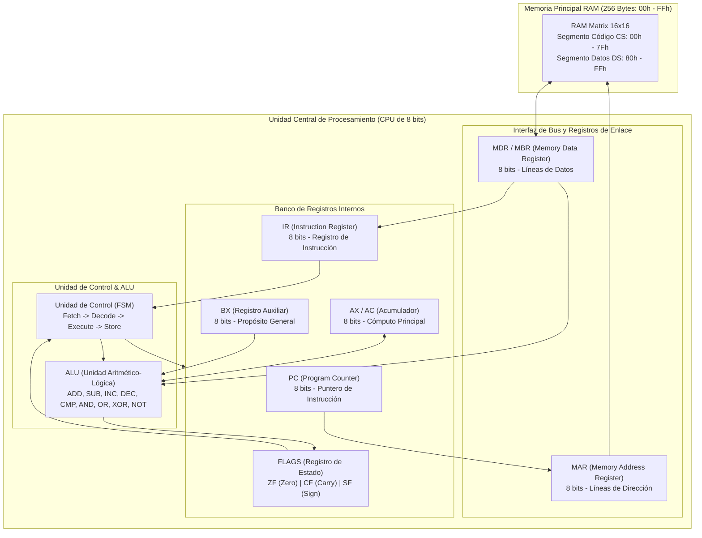
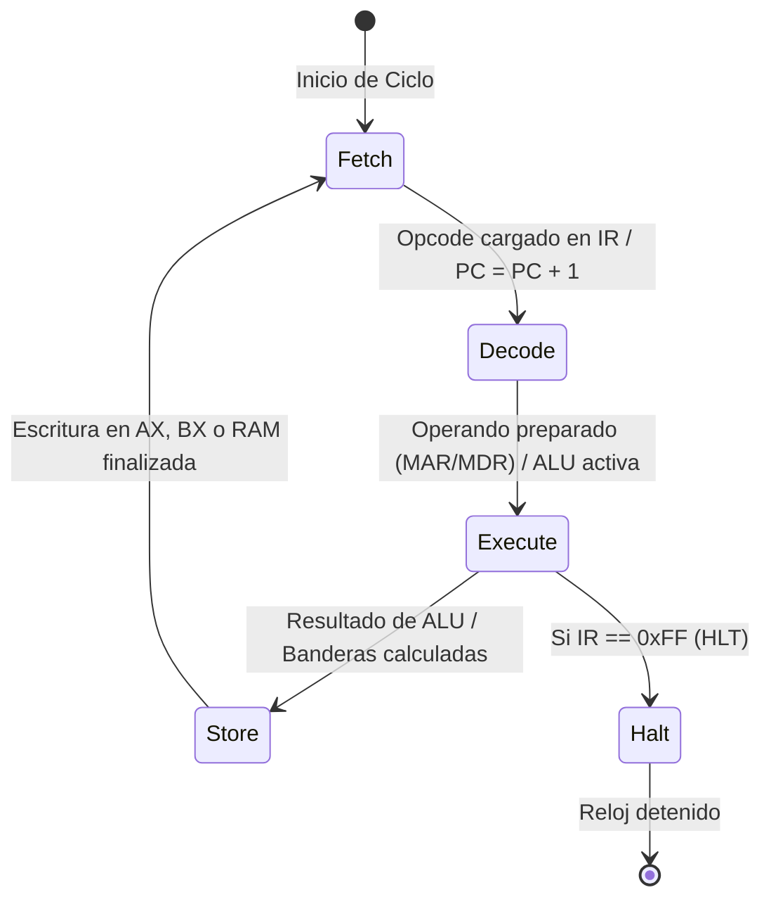

# Simulador de CPU (Arquitectura von Neumann / x86 de 8 bits) y Memoria Principal

**Universidad Católica Boliviana "San Pablo"**  
**Departamento de Ingenierías y Ciencias Exactas — Semestre 1/2026**  
**Materia:** Arquitectura de Computadoras (SIS-131)  
**Docente:** Ing. Paulo César Loayza Carrasco  
**Estudiante:** Kevin (Kevin07k)  
**Fecha de Entrega:** 29 de Septiembre de 2026  

---

## 1. Contexto Académico y Proyección Formativa

El presente proyecto implementa un **Simulador de Computadora von Neumann de 8 bits** con ciclo de instrucción completo y gestión de memoria física, desarrollado en **JavaScript modular para Google Apps Script (GAS)** y desplegado sobre una interfaz interactiva de **Google Sheets**.

### 🔹 Evolución Modular hacia el Segundo Parcial
El diseño de software sigue estrictamente el principio de responsabilidad única (SRP) y desacoplamiento de componentes. El núcleo actual (Memoria RAM, Registros, ALU y Unidad de Control) está arquitecturado de forma extensible para incorporar en el **Segundo Parcial**:
1. Bus del Sistema multiplexado en tiempo (Multiplexed System Bus).
2. Controladores de Entrada/Salida (I/O Controllers) y mapeo por puertos / memoria.
3. Gestión de Interrupciones vectorizadas y periféricos interactivos.

---

## 2. Diagrama de Bloques de Arquitectura de Hardware (Mermaid)

El siguiente esquema modela las interconexiones entre los componentes del procesador y la memoria:



---

## 3. Descomposición del Ciclo de Instrucción (4 Fases del Reloj)

Cada instrucción del procesador atraviesa estrictamente las 4 fases de la Máquina de Estados Finitos (FSM):



1. **Fetch (Búsqueda):**
   $$\text{MAR} \leftarrow \text{PC}$$
   $$\text{MDR} \leftarrow \text{RAM}[\text{MAR}]$$
   $$\text{IR} \leftarrow \text{MDR}$$
   $$\text{PC} \leftarrow (\text{PC} + 1) \pmod{256}$$
2. **Decode (Decodificación):**
   * La Unidad de Control interpreta el byte en $\text{IR}$ determinando el modo de direccionamiento.
   * Si la instrucción ocupa 2 bytes (inmediata o directa), se recupera el segundo byte: $\text{MAR} \leftarrow \text{PC}$, $\text{MDR} \leftarrow \text{RAM}[\text{MAR}]$, $\text{Operando} \leftarrow \text{MDR}$, $\text{PC} \leftarrow \text{PC} + 1$.
3. **Execute (Ejecución):**
   * La ALU procesa la operación aritmética o lógica y actualiza el registro de estado $\text{FLAGS} (\text{ZF}, \text{CF}, \text{SF})$.
   * Para saltos condicionales ($\text{JZ}, \text{JNZ}$) o incondicionales ($\text{JMP}$), se evalúa la condición y se carga la nueva dirección en el $\text{PC}$.
4. **Store / Write-back (Almacenamiento):**
   * El resultado se graba en el registro destino ($\text{AX}$ o $\text{BX}$) o se escribe en la memoria física: $\text{RAM}[\text{MAR}] \leftarrow \text{MDR}$.

---

## 4. Conjunto Formal de Instrucciones (ISA Ensamblador)

| Opcode (Hex) | Mnemónico | Operandos | Bytes | Modos | Acción / Semántica | Banderas Afectadas |
| :---: | :--- | :--- | :---: | :---: | :--- | :---: |
| `0x01` | `MOV` | `AX, imm` | 2 | Inmediato | $AX \leftarrow imm$ | Ninguna |
| `0x02` | `MOV` | `BX, imm` | 2 | Inmediato | $BX \leftarrow imm$ | Ninguna |
| `0x03` | `MOV` | `AX, BX` | 1 | Registro | $AX \leftarrow BX$ | Ninguna |
| `0x04` | `MOV` | `BX, AX` | 1 | Registro | $BX \leftarrow AX$ | Ninguna |
| `0x05` | `LOAD` | `AX, [dir]` | 2 | Directo | $AX \leftarrow \text{RAM}[dir]$ | Ninguna |
| `0x06` | `LOAD` | `BX, [dir]` | 2 | Directo | $BX \leftarrow \text{RAM}[dir]$ | Ninguna |
| `0x07` | `STORE` | `[dir], AX` | 2 | Directo | $\text{RAM}[dir] \leftarrow AX$ | Ninguna |
| `0x08` | `STORE` | `[dir], BX` | 2 | Directo | $\text{RAM}[dir] \leftarrow BX$ | Ninguna |
| `0x10` | `ADD` | `AX, imm` | 2 | Inmediato | $AX \leftarrow AX + imm$ | `ZF`, `CF`, `SF` |
| `0x11` | `ADD` | `AX, BX` | 1 | Registro | $AX \leftarrow AX + BX$ | `ZF`, `CF`, `SF` |
| `0x12` | `SUB` | `AX, imm` | 2 | Inmediato | $AX \leftarrow AX - imm$ | `ZF`, `CF`, `SF` |
| `0x13` | `SUB` | `AX, BX` | 1 | Registro | $AX \leftarrow AX - BX$ | `ZF`, `CF`, `SF` |
| `0x14` | `INC` | `AX` | 1 | Implícito | $AX \leftarrow AX + 1$ | `ZF`, `CF`, `SF` |
| `0x15` | `INC` | `BX` | 1 | Implícito | $BX \leftarrow BX + 1$ | `ZF`, `CF`, `SF` |
| `0x16` | `DEC` | `AX` | 1 | Implícito | $AX \leftarrow AX - 1$ | `ZF`, `CF`, `SF` |
| `0x17` | `DEC` | `BX` | 1 | Implícito | $BX \leftarrow BX - 1$ | `ZF`, `CF`, `SF` |
| `0x18` | `CMP` | `AX, imm` | 2 | Inmediato | Prueba $AX - imm$ (solo flags) | `ZF`, `CF`, `SF` |
| `0x19` | `CMP` | `AX, BX` | 1 | Registro | Prueba $AX - BX$ (solo flags) | `ZF`, `CF`, `SF` |
| `0x20` | `AND` | `AX, imm` | 2 | Inmediato | $AX \leftarrow AX \land imm$ | `ZF`, `SF`, `CF=0` |
| `0x21` | `AND` | `AX, BX` | 1 | Registro | $AX \leftarrow AX \land BX$ | `ZF`, `SF`, `CF=0` |
| `0x22` | `OR` | `AX, imm` | 2 | Inmediato | $AX \leftarrow AX \lor imm$ | `ZF`, `SF`, `CF=0` |
| `0x23` | `OR` | `AX, BX` | 1 | Registro | $AX \leftarrow AX \lor BX$ | `ZF`, `SF`, `CF=0` |
| `0x24` | `XOR` | `AX, imm` | 2 | Inmediato | $AX \leftarrow AX \oplus imm$ | `ZF`, `SF`, `CF=0` |
| `0x25` | `XOR` | `AX, BX` | 1 | Registro | $AX \leftarrow AX \oplus BX$ | `ZF`, `SF`, `CF=0` |
| `0x26` | `NOT` | `AX` | 1 | Implícito | $AX \leftarrow \sim AX$ | `ZF`, `SF` |
| `0x30` | `JMP` | `dir` | 2 | Directo | $PC \leftarrow dir$ | Ninguna |
| `0x31` | `JZ` | `dir` | 2 | Directo | Si $ZF=1 \implies PC \leftarrow dir$ | Ninguna |
| `0x32` | `JNZ` | `dir` | 2 | Directo | Si $ZF=0 \implies PC \leftarrow dir$ | Ninguna |
| `0xFF` | `HLT` | *(ninguno)* | 1 | Implícito | Detiene el ciclo de reloj | Ninguna |

---

## 5. Análisis y Traza Matemática de los Programas Demostrativos

### 🔹 Programa 1: Multiplicación por Sumas Sucesivas ($6 \times 7 = 42\text{d} / \text{0x2Ah}$)
* **Ubicación de Variables:** Multiplicando en `RAM[0x80] = 0x06`, Multiplicador/Contador en `RAM[0x81] = 0x07`, Resultado en `RAM[0x82] = 0x00`.

#### Traza de Iteraciones:
| Iteración | Contador (`0x81`) | AX (`0x82`) | BX (`0x80`) | ZF | CF | Acción Realizada |
| :---: | :---: | :---: | :---: | :---: | :---: | :--- |
| **Inicio** | `0x07` (7d) | `0x00` (0d) | `0x06` (6d) | 0 | 0 | Inicialización en memoria |
| **Paso 1** | `0x06` (6d) | `0x06` (6d) | `0x06` (6d) | 0 | 0 | Suma $0 + 6 = 6$ |
| **Paso 2** | `0x05` (5d) | `0x0C` (12d) | `0x06` (6d) | 0 | 0 | Suma $6 + 6 = 12$ |
| **Paso 3** | `0x04` (4d) | `0x12` (18d) | `0x06` (6d) | 0 | 0 | Suma $12 + 6 = 18$ |
| **Paso 4** | `0x03` (3d) | `0x18` (24d) | `0x06` (6d) | 0 | 0 | Suma $18 + 6 = 24$ |
| **Paso 5** | `0x02` (2d) | `0x1E` (30d) | `0x06` (6d) | 0 | 0 | Suma $24 + 6 = 30$ |
| **Paso 6** | `0x01` (1d) | `0x24` (36d) | `0x06` (6d) | 0 | 0 | Suma $30 + 6 = 36$ |
| **Paso 7** | `0x00` (0d) | `0x2A` (42d) | `0x06` (6d) | 1 | 0 | Suma $36 + 6 = 42$ |
| **Fin** | `0x00` (0d) | `0x2A` (42d) | `0x06` (6d) | 1 | 0 | $\text{CMP } AX, 0 \implies ZF=1 \implies \text{JZ}$ a `HLT` |

---

### 🔹 Programa 2: Serie de Fibonacci (Hasta 8-bit Overflow: 233d / 0xE9h)
* **Términos generados:** $0, 1, 1, 2, 3, 5, 8, 13, 21, 34, 55, 89, 144, 233 (\text{0xE9h})$.
* **Almacenamiento dinámico:** $F(n-2) \rightarrow \text{0x80}$, $F(n-1) \rightarrow \text{0x81}$, $F(n) \rightarrow \text{0x82}$.

---

## 6. Manual de Usuario y Guía de Operación

1. **Configuración Inicial:**
   * Abrir la hoja de cálculo de Google.
   * Ejecutar en el menú superior **`⚙️ Simulador CPU 8-Bit` ➔ `🛠️ Formatear / Reiniciar Hoja (Setup)`**.
2. **Carga de Algoritmos:**
   * Seleccionar **`📂 Cargar Programa: Multiplicación Aritmética`** o **`📂 Cargar Programa: Serie de Fibonacci`**.
3. **Modos de Ejecución:**
   * **`⏯️ Paso a Paso (Micro-fase):`** Avanza exactamente una fase del reloj ($\text{Fetch} \rightarrow \text{Decode} \rightarrow \text{Execute} \rightarrow \text{Store}$).
   * **`⏭️ Paso a Paso (Instrucción):`** Ejecuta las 4 fases de una instrucción completa en un solo clic.
   * **`▶️ Ejecución Continua (Run):`** Procesa el programa automáticamente hasta encontrar `HLT (0xFF)`.
   * **`🔄 Reset:`** Restaura los registros $PC, IR, MAR, MDR, AX, BX$ y banderas a $0$, preservando el programa en memoria RAM.

---

## 7. Estructura del Repositorio y Modularidad

```
├── .clasp.json              # Configuración de enlace a Google Apps Script
├── .claspignore             # Filtro de despliegue local ➔ nube
├── .gitignore               # Exclusiones de control de versiones Git
├── appsscript.json          # Manifiesto oficial del proyecto Apps Script (V8 Runtime)
├── README.md                # Documentación técnica formal con Mermaid y tablas ISA
├── Memory.js                # RAM de 256 bytes (00h-FFh), segmentación CS/DS y Read/Write
├── Registers.js             # Banco de Registros (PC, IR, MAR, MDR, AX, BX) y FLAGS
├── Alu.js                   # ALU de 8 bits con cálculo de banderas ZF, CF, SF
├── ControlUnit.js           # Decodificador de Opcodes, modos y desensamblador
├── Cpu.js                   # FSM del ciclo de 4 fases (Fetch, Decode, Execute, Store)
├── Logger.js                # Buffer cronológico de micro-operaciones
├── Ui.js                    # Renderizador de matriz 16x16 y animaciones en Sheets
├── Programs.js              # Ensamblador de programas Fibonacci y Multiplicación
└── Main.js                  # Entrypoint, persistencia con PropertiesService y macros
```

---

## 8. Guía para la Defensa Oral (15 Minutos Estrictos)

| Intervalo | Enfoque de la Defensa | Contenido a Demostrar |
| :--- | :--- | :--- |
| **Min 0 - 2** | Arquitectura y Hardware | Explicar la segmentación de memoria (CS: `00h-7Fh`, DS: `80h-FFh`), banco de registros y la tabla de 29 Opcodes de la ISA. |
| **Min 2 - 4** | Metodología y Auditoría | Mostrar el tablero Kanban en GitHub Projects (5 columnas), el historial continuo de commits semánticos y el flujo local-first con `clasp`. |
| **Min 4 - 10** | Demostración en Vivo | Ejecutar el ciclo paso a paso ($\text{Fetch} \rightarrow \text{Decode} \rightarrow \text{Execute} \rightarrow \text{Store}$), evidenciar el salto condicional `JZ` y la actualización de banderas `ZF/CF/SF`. |
| **Min 10 - 15**| Preguntas y Modificación | Modificar un operando en vivo en la celda de memoria o insertar una instrucción `ADD AX, imm` para demostrar dominio conceptual total. |
